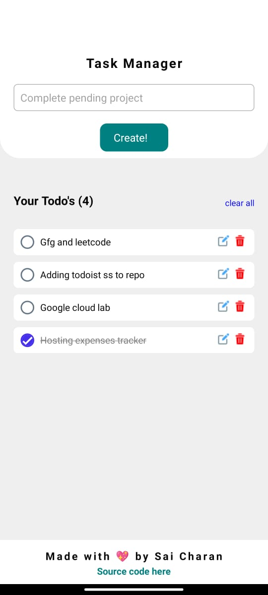
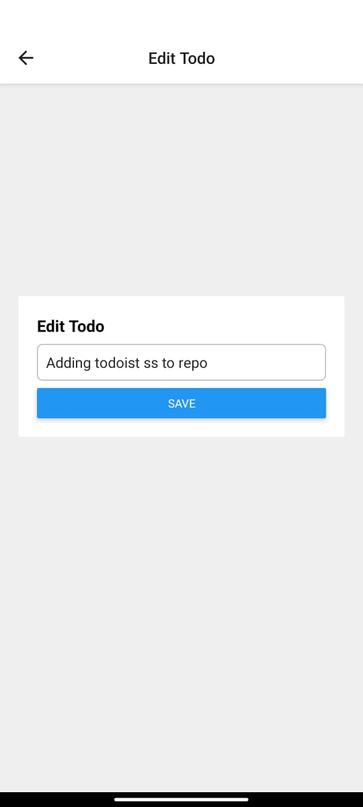

# Todoist - Todo App made using React Native
This is an open source todo app made using react native. It saves the data using async storage.

## Screenshots

  
  

## Download
- [link to download](https://expo.dev/accounts/saicharan0662/projects/todo-app/builds/70913a66-0501-4a1c-bf75-f9725e673c06)

## Contributing
Pull requests are welcome.
- Fort this repository.
- Create your branch and do the work.
- Push your branch to the repo.
- Create a pull request to the upstream repo.

### Give this repo a ⭐ if you like it.

